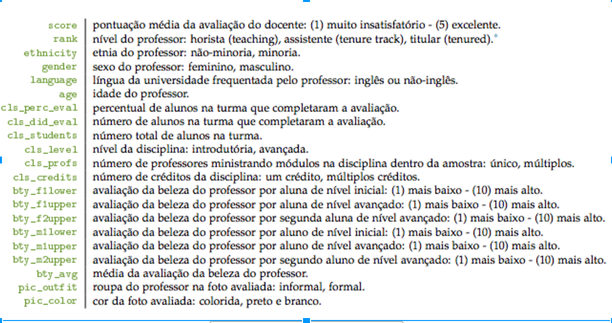

```{r warning=FALSE, echo=FALSE}
library(tidyverse)
library(broom)
library(modelr)
source(here::here("code/lib.R"))
theme_set(theme_report())

knitr::opts_chunk$set(tidy = FALSE,
                      fig.width = 6,
                      fig.height = 5)

paleta = c("#404E4D",
           "#92DCE5",
           "#938BA1",
           "#2D3142",
           "#F4743B")
```


## Dados sobre beleza e avaliação de professores da Universidade do Texas em Austin 




```{r warning=FALSE, echo=FALSE}

avaliacoes = readr::read_csv(here::here("data/evals.csv"))

avaliacoes %>% 
  ggplot(aes(x = score)) + 
  geom_histogram(bins = 15, fill = paleta[1])

avaliacoes %>% 
  ggplot(aes(x = bty_avg)) + 
  geom_histogram(bins = 15, fill = paleta[2])


```

## Objetivo
## Análises

```{r warning=FALSE, echo=FALSE}

avaliacoes %>%
ggplot(aes(x = score, y = bty_avg)) + 
  geom_point()


```


```{r warning=FALSE, echo=FALSE}

modelo1 = lm(score ~ bty_avg, data = avaliacoes)

tidy(modelo1, conf.int = TRUE, conf.level = 0.95)
glance(modelo1)


```

```{r warning=FALSE, echo=FALSE}


```


## Conclusões
